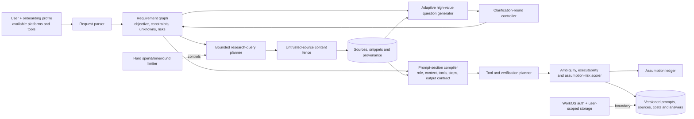
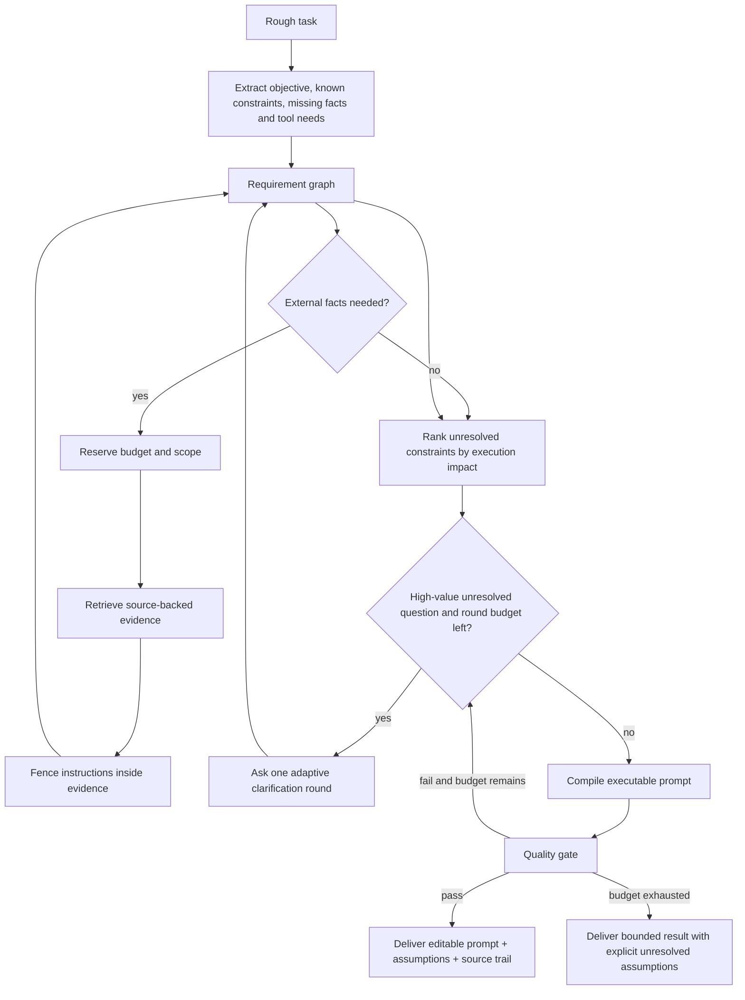
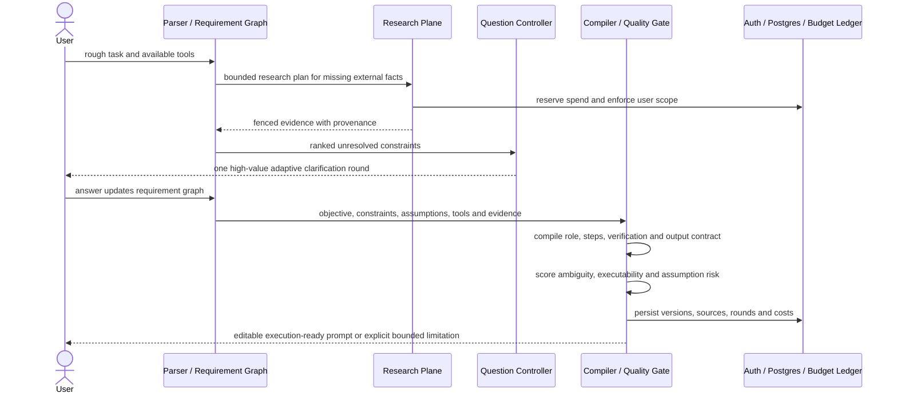

# Promptwell

Promptwell researches a rough request, applies the bundled prompting guide and saved user profile, asks only unresolved clarification questions, and compiles the answers into an execution-ready prompt.

## Product behavior

- First-sign-in onboarding records the user’s platforms, available tools, and instruction-file formats.
- Account defaults and per-workspace overrides are stored in PostgreSQL and applied by the server-side research engine.
- Prompt history is synced to the authenticated account rather than browser storage.
- Research produces an adaptive question set, source trail, tool plan, and verification plan.
- Generated prompts route Graphify, Context7, Headroom, web search, MCP, skills, and instruction files only when relevant and available.

## Local setup

1. Copy `.env.example` to `.env.local`.
2. Add the WorkOS credentials and redirect URI.
3. Add a PostgreSQL connection string in `DATABASE_URL`, then apply `db/schema.sql`.
4. Add a newly created `OPENAI_API_KEY`. Do not reuse a key that has appeared in chat, logs, or source control.
5. Add `http://localhost:3000/auth/callback` to the WorkOS redirect allowlist.
6. Run `npm install` and `npm run dev`.
7. Optional checks: `npm run lint`, `npm run typecheck`, `npm test`, and `npm run build`.

## Quality gate

Research keeps iterating until the local quality score reaches **85** or the engine hits **4** research rounds. If the gate is still unmet after those rounds, Promptwell stops calling the research API, shows the best compiled prompt, and surfaces a clear score warning so the monthly OpenAI allowance is not burned on open-ended loops.

## Spending controls

Set the OpenAI project’s monthly budget to `$13` in the OpenAI dashboard. That provider-side project budget is the authoritative cap because it still applies across deploys, restarts, and any other use of the key.

`OPENAI_MONTHLY_REQUEST_CAP=250` provides a conservative in-process backstop based on current GPT-5.4-mini and web-search pricing. Only successful provider responses count toward this cap. It resets when a server instance restarts and is not a substitute for the provider-side project budget.

## Security boundaries

- The OpenAI key is read only by the server route and is never included in browser bundles.
- Every generation endpoint requires a valid WorkOS session.
- Profile and session queries are scoped to the authenticated WorkOS user ID.
- Requests are limited per user and globally per running server instance.
- Prompt input is length-limited and fenced as untrusted source material.
- Web content is treated as untrusted data, not executable instructions.

<!-- architecture-atlas-v5:start -->
## Architecture Atlas v5

These editable Mermaid diagrams mirror the [Notion architecture dossier](https://app.notion.com/p/3b467342e8c1818192a9d435ce799772?pvs=204).

### 1. Compilation anatomy



### 2. Bounded-clarification wiring



### 3. Runtime narrative



### 4. Reliability model

```mermaid
stateDiagram-v2
  [*] --> DRAFT
  DRAFT --> PARSED --> RESEARCHING
  RESEARCHING --> QUESTIONING
  QUESTIONING --> PARSED: answer received
  PARSED --> COMPILING --> QUALITY_GATE
  QUALITY_GATE --> READY: threshold met
  QUALITY_GATE --> QUESTIONING: budget remains and uncertainty is material
  QUALITY_GATE --> BUDGET_EXHAUSTED: hard limit reached
  RESEARCHING --> FAILED: source or authorization failure
```

<!-- architecture-atlas-v5:end -->
